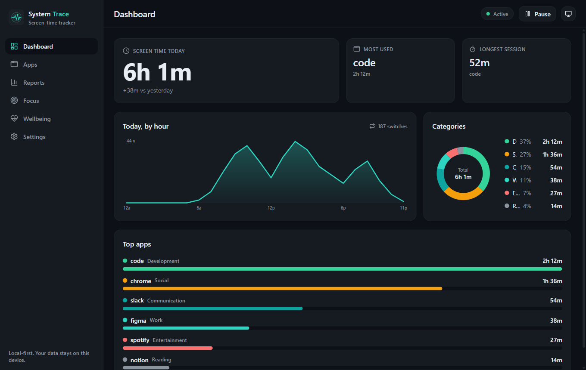
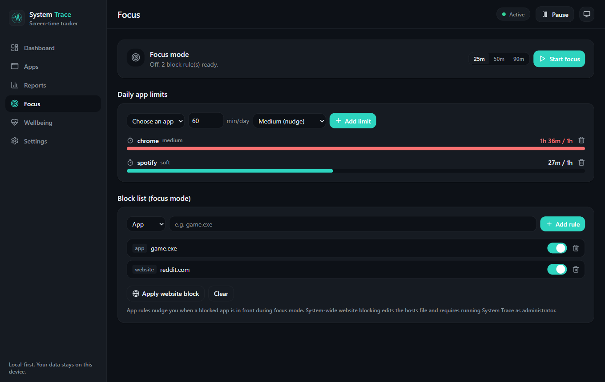
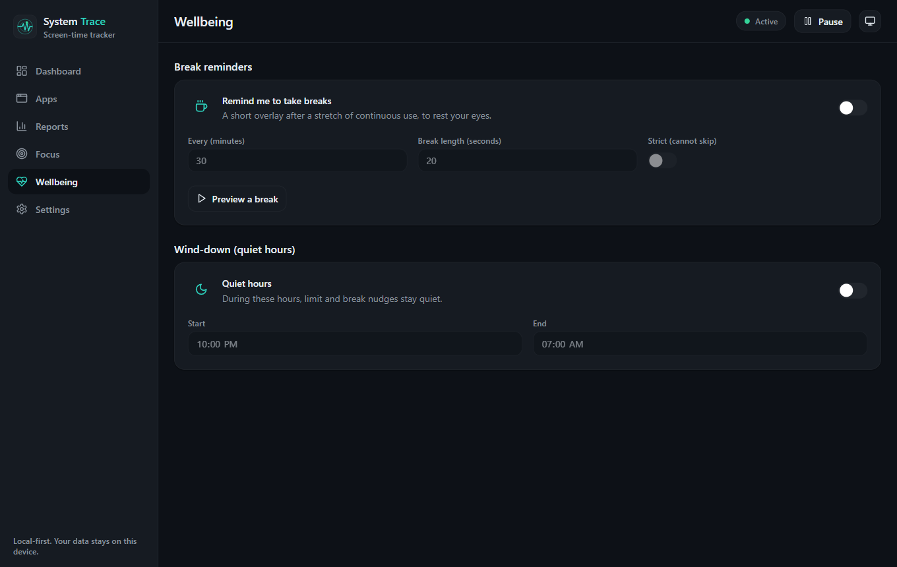
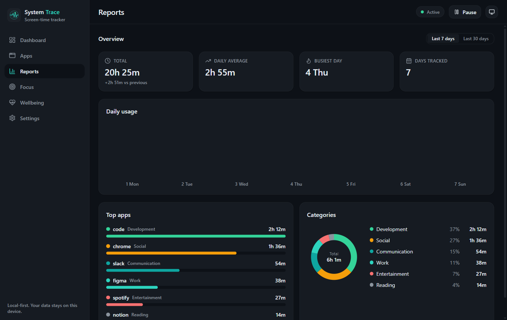

[](LICENSE)
[](#installation)
[](https://tauri.app/)
[](https://www.rust-lang.org/)
[](https://react.dev/)
[](#contributing)

# System Trace

> Understand your screen time. Privately. A free, **open-source**, privacy-first screen-time
> tracker for **Windows, macOS, and Linux** - your activity data never leaves your device.

System Trace records which apps and windows you use and for how long, detects idle time, and
turns it into clear dashboards and reports. It grows from tracking into per-app limits, focus
mode, and gentle wellbeing reminders - all stored locally, with no cloud, no account, and no
telemetry.

Website: **https://system-trace.pages.dev**

## Table of Contents

- [About Project](#about-project)
- [Why System Trace](#why-system-trace)
- [Features](#features)
- [Installation](#installation)
- [Build From Source](#build-from-source)
- [How It Works](#how-it-works)
- [Project Structure](#project-structure)
- [Tech Stack](#tech-stack)
- [SSoC 2026](#ssoc-2026)
- [Contributing](#contributing)
- [Roadmap](#roadmap)
- [License](#license)
- [Contact Me](#contact-me)
- [Acknowledge](#acknowledge)

## About Project

Most screen-time tools are either private but rough, or polished but cloud-based - and almost
none treat Windows, macOS, and Linux equally. System Trace is built to be all three at once:
**cross-platform, private, and well designed.**

Everything runs locally. A small background agent samples the active window and idle state,
stores usage in a local SQLite database, and the app shows you calm, readable reports. Your
data is yours: export it, delete it, or exclude apps at any time.

The marketing website lives in a separate repository
([System-Trace-Website](https://github.com/anandsundaramoorthysa/System-Trace-Website)).

## Screenshots

**Dashboard**


**Limits and Focus**


**Break Reminders and Wellbeing**


**Weekly Screen-Time Report**


## Why System Trace

| Capability | Cloud trackers (e.g. RescueTime) | Open trackers (e.g. ActivityWatch) | System Trace |
|---|---|---|---|
| Windows, macOS, and Linux | Partial (often no Linux) | Yes | **Yes** |
| Private and local-first | No (cloud) | Yes | **Yes** |
| Polished, modern interface | Yes | Partial | **Yes** |
| Per-app limits and focus mode | Partial | No | **Yes** |
| Break reminders and quiet hours | No | No | **Yes** |
| Free and open source (MIT) | No | Yes | **Yes** |

## Features

- **Automatic tracking:** records the active app and window with smart idle detection that
  still counts videos and meetings (no "watching a video reads as idle" problem).
- **Local-first storage:** a local SQLite database with daily and weekly rollups. No cloud,
  no account, no telemetry.
- **Clear dashboard:** a "Screen Time Today" hero, top apps, category split, and an
  hour-by-hour timeline.
- **History explorer:** walk back through any past **day**, **week**, or **month**.
  Day view shows that day's hourly chart, top apps, categories, and longest session;
  week and month views show the daily-usage bars and aggregates for the picked period.
  Left and right arrow keys step through history.
- **Neutral categories:** group apps your way, with optional productivity scoring.
- **Per-app daily limits:** set a cap and choose how strict the nudge is when you reach it.
- **Focus mode:** start a focus session that blocks distracting apps and websites.
- **Wellbeing:** break reminders to rest your eyes, plus quiet hours that silence nudges.
- **Summary notifications:** off, daily, weekly, or both - and they catch up if the app was
  closed across a boundary.
- **Privacy controls:** export to CSV or JSON, one-click wipe, app exclusions, and
  window-title capture that is off by default.
- **Dark and light themes** using the "Signal" palette. lucide-react icons, no emoji.

## Installation

Download the installer for your OS from the
[Releases](https://github.com/anandsundaramoorthysa/System-Trace/releases) page:

| OS | File |
|---|---|
| Windows | `.msi` or `.exe` |
| macOS | `.dmg` |
| Linux | `.AppImage`, `.deb`, or `.rpm` |

> First-run note: the app is not yet code-signed or notarized. On Windows, SmartScreen may
> warn - choose More info, then Run anyway. On macOS, right-click the app and choose Open the
> first time. Linux AppImages run without installing anything. Signing and notarization are
> planned.

## Build From Source

### Prerequisites

- **Rust** (stable) via [rustup](https://rustup.rs/)
- **Node 20+** and **pnpm** (`npm install -g pnpm`)
- **Tauri CLI** (`pnpm add -g @tauri-apps/cli`) and your OS build dependencies:
  - Windows: Microsoft C++ Build Tools and the WebView2 runtime
  - macOS: Xcode Command Line Tools
  - Linux: `webkit2gtk`, `libgtk-3-dev`, `librsvg2-dev`, and related packages
    (see Tauri's Linux prerequisites)

### Run and build

```bash
# from the app/ directory
cd app

# 1. Install JS dependencies
pnpm install

# 2. Run the app in development
pnpm tauri dev

# 3. Build the production app and installer for this OS
pnpm tauri build

# 4. Generate the icon set from the master logo (optional)
pnpm tauri icon ../assets/logo/system-trace-dark.svg
```

```bash
# Rust unit tests and lints (from app/src-tauri)
cd app/src-tauri
cargo test
cargo clippy --all-targets
cargo fmt --all -- --check
```

## How It Works

The Rust side owns the truth (tracking and the database); the React side is a thin, fast
client that reads summaries and renders them. They talk only through Tauri commands and events.

```
                +-----------------------------+
                |       System Trace app       |
                |          (Tauri 2)           |
                +-----------------------------+
                              |
        +---------------------+----------------------+
        |                                            |
   Collector (Rust background agent)           UI (React + TypeScript)
   - samples active window + idle              - opened from the tray
   - per-OS watchers (Win32 / macOS / X11)     - reads summaries, renders charts
   - batches writes                            - dark / light, lucide icons
        |                                            ^
        v                                            |
   +---------------------+      +----------------------------+
   |   SQLite (local)    | ---> |  Aggregation (Rust)        |
   |  raw events + rollups| <-- |  daily / weekly summaries  |
   +---------------------+      +----------------------------+
```

The full design is in [`docs/SYSTEM_DESIGN.md`](docs/SYSTEM_DESIGN.md), and the feature plan
mapped to market gaps is in [`docs/FEATURES.md`](docs/FEATURES.md).

## Project Structure

```
System-Trace/
  app/
    src/                 React + TypeScript UI (pages, components, theme, lib)
    src-tauri/
      src/
        main.rs          entry point
        lib.rs           Tauri app setup, tray, plugins, command registration
        collector.rs     sampler + session-builder + background runtime
        platform/        Watcher trait + windows.rs / macos.rs / linux.rs
        db.rs            SQLite, migrations, aggregation, export/import
        commands.rs      Tauri command handlers
        models.rs        shared types (mirror of src/lib/types.ts)
        blocker.rs       hosts-file website blocking (gated)
      tauri.conf.json
      icons/             generated app icons
  assets/logo/           brand logo, wordmark, icon notes
  docs/                  SYSTEM_DESIGN, FEATURES, TECH_STACK, BRAND, CONVENTIONS, DISTRIBUTION
  .github/workflows/     CI (build/lint/test matrix) and release (installers)
```

## Tech Stack

| Layer | Choice |
|---|---|
| App shell | Tauri 2 |
| Core / tracking | Rust |
| UI | React + TypeScript |
| Storage | SQLite (rusqlite, bundled) |
| Charts | uPlot |
| Styling | Tailwind CSS |
| Package manager | pnpm |
| Testing | Playwright (UI), cargo test (core) |

## SSoC 2026

System Trace is a participating project in
[Social Summer of Code (SSoC) Season 5 - 2026](https://socialsummerofcode.com/).

If you are an SSoC26 contributor, look for issues tagged
[`ssoc26`](https://github.com/anandsundaramoorthysa/System-Trace/issues?q=is%3Aissue+is%3Aopen+label%3Assoc26)
and pick one that matches your skill level: `good first issue`, `easy`, `medium`,
or `hard`. Each issue has a clear scope and acceptance criteria.

Before starting work:

1. Comment on the issue to claim it (one issue, one contributor).
2. Read [CONTRIBUTING.md](CONTRIBUTING.md) - especially the principles and the
   IPC contract section.
3. Keep your PR focused on the issue you claimed. One issue, one pull request.

Coding phase: 1 June 2026 - 1 August 2026. Reviews are usually within two or
three days; if a PR sits longer, feel free to ping in the PR comments.

## Contributing

Contributions are welcome - bug fixes, the macOS and Linux watchers, new features, or docs.

### Guidelines

- **Discuss first:** for anything non-trivial, open an
  [issue](https://github.com/anandsundaramoorthysa/System-Trace/issues) before coding.
- **Respect the principles:** local-first and private (no telemetry, nothing leaves the
  machine), cross-platform, and no emoji - use lucide-react icons.
- **Keep the contract in sync:** `app/src-tauri/src/models.rs` and `app/src/lib/types.ts` are
  two halves of one IPC contract; change them together.
- **Verify before a PR:** `cargo test`, `cargo clippy`, `cargo fmt --check`, and `pnpm build`
  must pass. The macOS and Linux watchers are verified by the CI matrix.

### Steps

1. **Fork** the [repository](https://github.com/anandsundaramoorthysa/System-Trace).
2. Create a branch: `git checkout -b feature/your-feature`.
3. Make your changes and run the checks above.
4. **Commit** with a clear message.
5. **Open a pull request** describing your change and linking any related issue.

[View Open Issues](https://github.com/anandsundaramoorthysa/System-Trace/issues)

## Roadmap

- [x] Phase 1 - Tracking core (collector, local storage, dashboard, dark/light)
- [x] Phase 2 - Control (per-app limits, focus mode, app/website block rules)
- [x] Phase 3 - Wellbeing (break reminders, quiet hours, summary notifications)
- [x] Phase 4 - CI workflows, packaging config, macOS and Linux watchers
- [ ] macOS window-title capture (Accessibility permission)
- [ ] Linux Wayland active-window support (X11 is done)
- [ ] System-wide website blocking enforcement (needs an elevated helper)
- [ ] Code signing and notarization, and an auto-updater
- [ ] Optional browser extension for per-website detail

See [`docs/FEATURES.md`](docs/FEATURES.md) for the full plan.

## License

This project is released under the **MIT License**. You are free to use, modify, and
distribute it under the terms of this license. See the [LICENSE](LICENSE) file for the full
text.

## Contact Me

If you have any questions, feedback, or suggestions, feel free to reach out:

- **Anand Sundaramoorthy** - [sanand03072005@gmail.com](mailto:sanand03072005@gmail.com?subject=About%20System%20Trace)
- **GitHub:** [@anandsundaramoorthysa](https://github.com/anandsundaramoorthysa)

## Acknowledge

Built with these excellent open-source projects:

- [Tauri](https://github.com/tauri-apps/tauri) - the cross-platform app shell
- [Rust](https://www.rust-lang.org/) - the core language for the tracking engine
- [React](https://github.com/facebook/react) - the dashboard UI
- [rusqlite](https://github.com/rusqlite/rusqlite) - local SQLite storage
- [uPlot](https://github.com/leeoniya/uPlot) - fast time-series charts
- [lucide-react](https://github.com/lucide-icons/lucide) - the icon set used in the UI
- [Tailwind CSS](https://github.com/tailwindlabs/tailwindcss) - styling
- [windows](https://github.com/microsoft/windows-rs), [x11rb](https://github.com/psychon/x11rb) - per-OS window APIs
- [ActivityWatch](https://github.com/ActivityWatch/activitywatch) - inspiration for the local, watcher-based approach

Thanks to the open-source community for the tools and guidance that made this possible.
