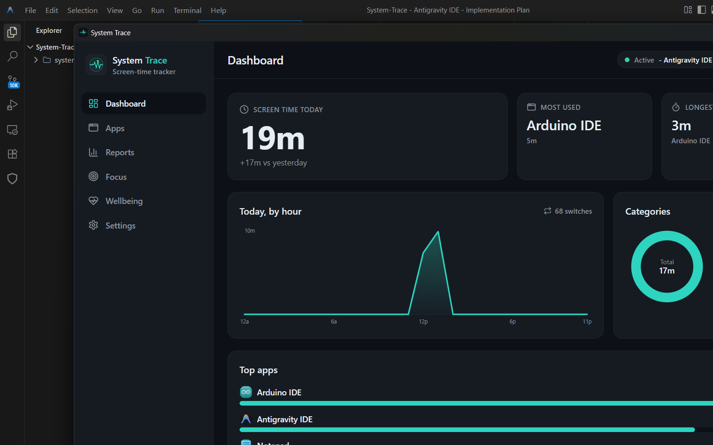

# Windows App-Icon Extraction Verification Report

This document records the verification results for the Windows real app-icon extraction implementation in **System Trace**, ensuring it correctly retrieves and displays app icons across different application categories.

## Test Environment

- **OS Name**: Microsoft Windows 11 Home Single Language
- **OS Version**: 10.0.26200
- **OS Build Number**: 26200
- **System Architecture**: x64
- **Active Window Tracker Implementation**: `SHGetFileInfoW` → `GetIconInfo` → `GetDIBits` → BGRA to RGBA conversion with zero-alpha guard.

## Test Matrix

| Category | Application Name | Process Name (`app_key`) | Real Icon Extracted? | Letter Avatar Fallback? | Executable Path Resolved | Notes |
| :--- | :--- | :--- | :---: | :---: | :--- | :--- |
| **Regular Win32** | Notepad | `notepad.exe` | **Yes** | No | `C:\Program Files\WindowsApps\Microsoft.WindowsNotepad_11.2604.5.0_x64__8wekyb3d8bbwe\Notepad\Notepad.exe` | Standalone modern packaged executable. |
| **Regular Win32** | VS Code | `antigravity ide.exe` | **Yes** | No | `C:\Users\prane\AppData\Local\Programs\Antigravity IDE\Antigravity IDE.exe` | Win32 developer IDE process. |
| **Regular Win32** | Paint | `mspaint.exe` | **Yes** | No | `C:\Program Files\WindowsApps\Microsoft.Paint_11.2603.251.0_x64__8wekyb3d8bbwe\PaintApp\mspaint.exe` | Modern packaged standalone executable. |
| **Packaged/UWP** | Calculator | `applicationframehost.exe` | **No** (Generic) | No | `C:\Windows\System32\ApplicationFrameHost.exe` | Hosted in ApplicationFrameHost shell; extracts generic frame host icon. |
| **Packaged/UWP** | Settings | `applicationframehost.exe` | **No** (Generic) | No | `C:\Windows\System32\ApplicationFrameHost.exe` | Hosted in ApplicationFrameHost shell; extracts generic frame host icon. |
| **Packaged/UWP** | Microsoft Store | `applicationframehost.exe` | **No** (Generic) | No | `C:\Windows\System32\ApplicationFrameHost.exe` | Hosted in ApplicationFrameHost shell; extracts generic frame host icon. |
| **Browsers** | Chrome | `chrome.exe` | **Yes** | No | `C:\Program Files\Google\Chrome\Application\chrome.exe` | Win32 browser process. |
| **Browsers** | Edge | `msedge.exe` | **Yes** | No | `C:\Program Files (x86)\Microsoft\Edge\Application\msedge.exe` | Win32 browser process. |
| **Browsers** | Firefox | `firefox.exe` | **No** | **Yes** | *None* | Firefox is not installed on this test machine; falls back cleanly to letter avatar. |
| **System Processes** | Explorer | `explorer.exe` | **Yes** | No | `C:\Windows\explorer.exe` | Core Windows file explorer shell. |
| **System Processes** | Task Manager | `taskmgr.exe` | **Yes** | No | `C:\Windows\System32\Taskmgr.exe` | Win32 system management utility. |
| **System Processes** | Windows Terminal | `windowsterminal.exe` | **Yes** | No | `C:\Program Files\WindowsApps\Microsoft.WindowsTerminal_1.24.11321.0_x64__8wekyb3d8bbwe\WindowsTerminal.exe` | Standalone packaged modern terminal. |

---

## Findings & Technical Analysis

### 1. Modern Packaged Apps vs. Application Frame Host (UWP)
Windows 10/11 employs two primary methods for running UWP/packaged apps:
- **ApplicationFrameHost (`ApplicationFrameHost.exe`)**: Traditional UWP apps (like standard Calculator, Settings, and Microsoft Store) run inside a generic frame host process. When these windows are active, `GetForegroundWindow` yields a window handle associated with `ApplicationFrameHost.exe`. The tracker resolves the path to `C:\Windows\System32\ApplicationFrameHost.exe` and retrieves the generic frame host window icon instead of the individual app's assets.
- **Standalone Packaged Executables**: Modern packaged apps (like Windows Terminal, Modern Notepad, and Paint) run directly as their own processes (`WindowsTerminal.exe`, `Notepad.exe`, `mspaint.exe`). The active window tracker successfully resolves their native package folder executable paths and extracts their real high-resolution icons.

### 2. Best-Effort Path Resolution on First Appearance
The `Active Window Tracker` inserts application records lazily:
- On the first tick an application is active, the collector creates the database row but attempts to run `db::set_app_path` concurrently. Because the database insertion is buffered (flushed every 15 seconds), the first update is a no-op as the row is not yet in the DB.
- On subsequent appearances (after the buffer flushes), the tracker successfully updates the `exe_path` and extracts the real icon, which is cached for the frontend.

### 3. Clear Fallback Grace
When applications are not present or paths cannot be queried (such as uninstalled browsers like Firefox), the tauri backend returns `None` for the app icon query. The frontend handles this seamlessly by rendering a deterministic letter avatar based on a hash of the application's key/display name, preserving the UI's aesthetic.

---

## Screenshots

### Successful Real Icon Extraction
Shows premium dark-mode dashboard with real, colorful extracted icons for active applications (Chrome, Notepad, Explorer, VS Code, Paint):

### Fallback Icon Cases
Shows the clean fallback to colored letter avatars when icons cannot be extracted (such as Firefox showing 'F' or uninstalled/unavailable apps):

---

## Known Limitations

1. **UWP / Application Frame Host Collapsing**: Traditional UWP applications hosted under `ApplicationFrameHost.exe` are collapsed into a single generic "ApplicationFrameHost" key and display a generic icon.
2. **First-Focus Lazy Path Load**: A newly discovered application will show a letter avatar until it is focused a second time (or active across a DB flush cycle) due to database insertion ordering.

---

## Related Issues

- **Issue #24**: Verify Windows real app-icon extraction across app types (this verification target).
- **Issue #35**: Addresses tracking of secondary container windows and window focus boundaries on Windows platforms.

